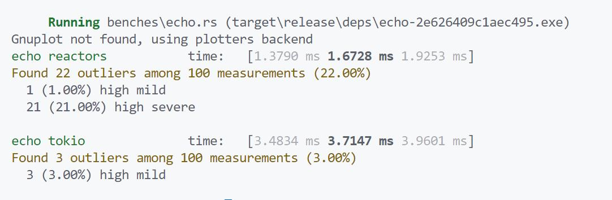

# reactors

[](https://crates.io/crates/reactors) [](https://docs.rs/reactors)   [](LICENSE)

**reactors** is a low-level cross-platform asynchronous io wrapper library for rust [`futures`](https://docs.rs/futures/0.3.27/futures/):

* `linux/android` epoll backend
* `macos/ios/freebsd` kqueue backend
* `windows` iocp backend

## bench



## Thread Model

**reactors** does not limit the thread model it uses. In particular, we can create multiple IoReactor objects to share the IO load

```rust no_run
use reactors::io::*;
use reactors::io::socket::tcp::TcpAcceptor;
use reactors::io::IoReactor;
use std::thread::spawn;
use futures::TryStreamExt;
use futures::{AsyncReadExt, AsyncWriteExt};
use futures::executor::block_on;
use std::time::Duration;
use reactors::Reactor;

fn main() -> anyhow::Result<()> {
    let acceptor_reactor = IoReactor::default();
    let connection_reactor = IoReactor::default();

    let mut acceptor_reactor_background = acceptor_reactor.clone();
    let mut connection_reactor_background = connection_reactor.clone();

    spawn(move || {
        acceptor_reactor_background.poll_once(Duration::from_millis(100)).unwrap();
    });

    spawn(move || {
        connection_reactor_background.poll_once(Duration::from_millis(100)).unwrap();
    });

    let mut acceptor = TcpAcceptor::new(acceptor_reactor, "127.0.0.1:1813".parse()?, Some(connection_reactor))?;

    block_on(async {
        while let Some((conn, _)) = acceptor.try_next().await.unwrap() {
            let mut reader = conn.to_read_stream(None);
            let mut writer = conn.to_write_stream(None);

            let mut buff = [0u8; 11];

            reader.read_exact(&mut buff).await.unwrap();

            assert_eq!(&buff, b"hello world");

            writer.write_all(&buff).await.unwrap();
        }
    });

    Ok(())
}
```
